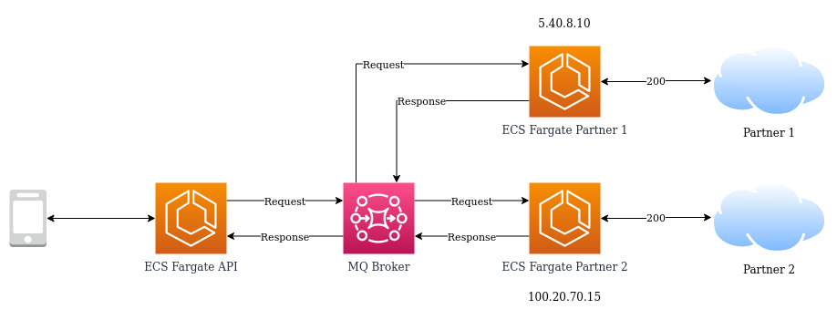

# Sample application using NodeJs and RabbitMQ

This is a sample code demonstrating how to use Express framework and RabbitMQ implementing [RPC Pattern](https://www.enterpriseintegrationpatterns.com/patterns/messaging/RequestReply.html).

Hosting the application on AWS, without code changes, just replacing RabbitMQ for Amazon MQ, and ECS Fargate for application containers.



Locally just run ```` docker compose up --build ```` at root folder, and Docker Compose starts everything.

Reference https://www.rabbitmq.com/tutorials/tutorial-six-javascript.html